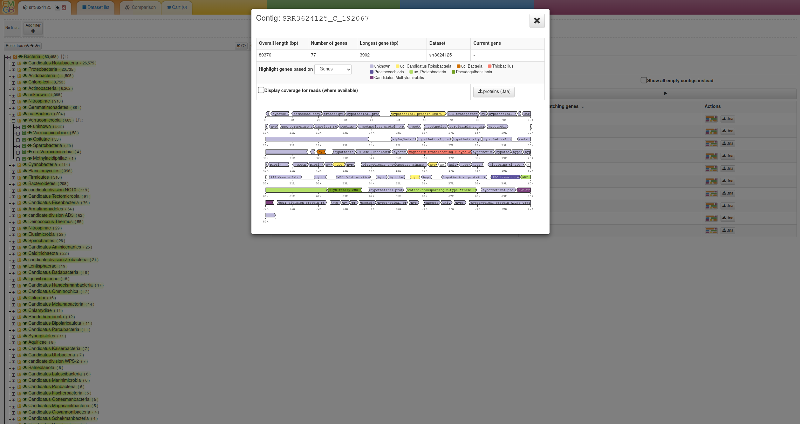

# Metagenomics-Toolkit

## Introduction

The Metagenomics-Toolkit or Toolkit for short is a scalable, data agnostic workflow that automates the analysis of short and long metagenomic reads obtained from Illumina or Oxford Nanopore Technology devices, respectively.
The Toolkit offers not only standard features expected in a metagenome workflow, such as quality control, assembly, binning, and annotation, but also distinctive features,
such as plasmid identification based on various tools, the recovery of unassembled microbial community members, and the discovery of microbial interdependencies through a combination of dereplication, cooccurrence, and genome-scale metabolic modeling.
Furthermore, the Metagenomics-Toolkit includes a machine learning-optimized assembly step that tailors the peak RAM value requested by a metagenome assembler to match actual requirements, thereby minimizing the dependency on dedicated high-memory hardware.

## Schematic Overview

The Toolkit can be applied in two steps which can be either applied in one execution or in two executions consecutively. 
In addition, each module c0an be executed separately. 

### Per-Sample Pipeline Overview

The per-sample part of the pipeline processes each dataset individually. This step includes quality control, assembly, binning and annotation of 
each dataset individually. You can read more at the getting started page.

### Aggregation Pipeline Overview

The aggregation part of the pipeline processes and combines the outputs of the "per-sample" part. MAGs of all input datasets are dereplicated and
the abundances of the MAG representatives are estimated. The MAG representatives are then used for cooccurrence analyses.

## EMGB

The Exploratory Metagenome Browser [(EMGB)](https://gitlab.ub.uni-bielefeld.de/cmg/emgb/emgb-server) is a web interface that has been developed for the visual exploration of metagenomic datasets. 
The majority of the Toolkit output including detected MAGs, MAG taxonomy, genes, pathways can be viewed via the Exploratory Metagenome Browser.
Large datasets containing millions of genes and their annotations are pre-processed and visualized, to be searched in real-time by the user. 
The platform provides access to different aspects of one or more datasets via an interactive taxonomic tree, a contig viewer, dynamic KEGG metabolic maps and different statistics.

## Further Reading

* If you are interested in testing the basic workflow, we recommend that you read the [Quickstart](quickstart.md) page.

* In case you want to run the workflow on a cluster then you can skip the Quickstart page and start directly with the [Getting Started](concept.md) section.

* If you want to run a specific module, then you can start with the [modules section](modules/introduction.md). 
